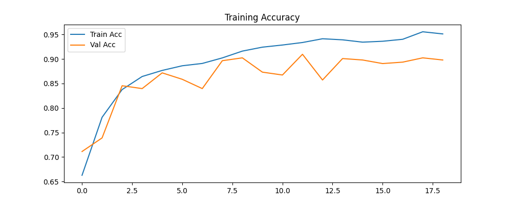
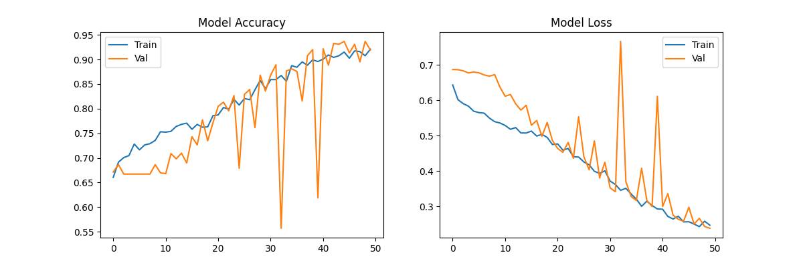
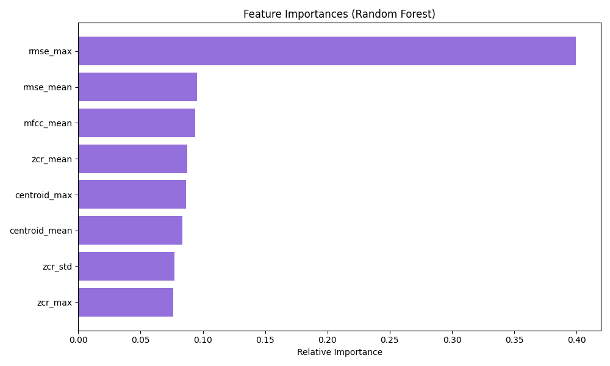

# Vinyl Scratch Detector

An automated system for detecting mechanical defects and scratches on vinyl records.

---

## Project Structure


```text
├── data_processing/                    # Data utility and ingestion modules
│   ├── download_data.py                # Dataset collection scripts
│   ├── feature_extraction.py           # Statistical signal characterization
│   └── preprocess.py                   # Audio labeling and preprocessing logic
├── main.py                             # FastAPI Server
├── models/                    
│   ├── cnn/                            # Convolutional Neural Network (Spectrogram analysis)
│   │   ├── melspec_generation.py       # Mel-spectrogram processing logic
│   │   ├── train_cnn.py                # CNN training pipeline
│   │   ├── tune_cnn.py                 # Hyperparameter tuning (Keras Tuner)
│   ├── random_forest_model/            # Random Forest
│   │   └── train_rf.py                 # RF training with GridSearchCV
│   ├── svm_model/                      # Support Vector Machine
│   │   └── train_svm.py                # SVM training
│   └── with_mert/                      # MERT Transformer-based models
│       ├── extracting_mert.py          # MERT hidden state feature extraction
│       ├── train_mert_model.py         # Classifier training on MERT embeddings
│       └── vinyl_mert_classifier.keras # Final MERT classifier weights
└── visualization/                      # Performance analytics
```

---

## Methodology: Feature Extraction

To characterize the differences between clean recordings and those containing mechanical damage, four key features are extracted from each audio segment using the **Librosa** library:

### 1. Zero Crossing Rate (ZCR)

* **Technical Description:** Measures the rate at which the signal changes its sign.
* **Application:** A vital indicator for impulse noise detection.

### 2. Root Mean Square Energy (RMSE)

* **Technical Description:** Determines the average volume level within a specific time window.
* **Application:** Helps identify sudden amplitude spikes. RMSE effectively distinguishes them from quieter background textures.

### 3. Mel-Frequency Cepstral Coefficients (MFCC)

* **Technical Description:** Represents the short-term power spectrum of sound based on the mel scale, mimicking human hearing.
* **Application:** Describes the overall timbre. This allows the model to differentiate natural instrument sounds from the "unnatural" mechanical sound. 

### 4. Spectral Centroid

* **Technical Description:** Indicates the center of mass of the spectrum, where the majority of the signal's energy is concentrated.
* **Application:** Corresponds to the perceived "brightness" of the sound. High centroid values suggest high-frequency content, characteristic of scratches.

---

## Model Optimization & Tuning

### Classic ML (Random Forest & SVM)

To improve the generalization of the **Random Forest** model, we utilized **GridSearchCV**. This allowed for the automated selection of optimal parameters.  By employing **5-fold cross-validation**, the model became more resistant to overfitting and less likely to generate False Positives on segments containing only background noise.

### CNN Tuning (Keras Tuner) & Lessons Learned

The CNN model underwent an extensive hyperparameter search using `keras-tuner` to maximize its sensitivity to audio defects.

* **Search Metric:** `val_recall`.
* **Execution:** The tuner ran for **1 hour and 29 minutes** (30 trials).
* **Best Result:** A `val_recall` of **1.0** was achieved with a Learning Rate of **1e-05**.
* **Outcome & Overfitting:** Despite the perfect recall score during the search, the experiment was ultimately considered **unsuccessful**. The model suffered from severe **overfitting**, becoming "hypersensitive" to any transient sounds. This resulted in a high number of False Positives, where complex musical elements (like sharp hi-hats) were incorrectly flagged as scratches.
---


## Setup & Usage

### 1. Environment Setup

```bash
conda create -n VinylScratchDetector python=3.12
conda activate VinylScratchDetector
pip install -r requirements.txt
```


### 2. Start the API

```bash
python main.py
```

Access the Swagger UI at: **[http://127.0.0.1:8000/docs](https://www.google.com/search?q=http://127.0.0.1:8000/docs)**

---

## Analysis & Results

### Training Performance (Deep Learning)
The training logs for our neural networks indicate successful convergence. The **MERT** model shows superior adaptability to musical contexts, while the **CNN** effectively captures the visual transients of physical scratches in the spectrograms.

| Model | Training Curves |
| :--- | :--- |
| **MERT Transformer** |  |
| **CNN Spectrogram** |  |


### Model Reliability (Classic ML)
To minimize "false alarms" during playback, we analyzed the performance of our classic ML models. These plots illustrate the balance between detecting actual scratches (Recall) and avoiding the misclassification of percussive musical elements.

* **Random Forest**: Excellent at identifying sharp, high-frequency pops.
* **SVM**: Provides a robust decision boundary for steady-state surface noise.

**Comparison Plot:**
.png)


### 3. Feature Importance
Using the Random Forest's feature importance attributes, we identified the primary features for vinyl damage.




---

## Performance Benchmark

| Model | Accuracy | Recall (Scratch) |
| --- | --- | --- |
| **MERT + TF** | ~96% | ~98% |
| **CNN** | ~91% | ~88% |
| **Random Forest** | ~89% | ~82% |
| **SVM** | ~87% | ~80% |


#### RandomForest Performance

```text
              precision    recall  f1-score   support

       Clean       0.96      0.99      0.98      2286
     Scratch       0.99      0.92      0.95      1141

    accuracy                           0.97      3427
   macro avg       0.97      0.96      0.96      3427
weighted avg       0.97      0.97      0.97      3427

```

#### SVM Performance

```text
              precision    recall  f1-score   support

       Clean       0.82      0.97      0.89      2286
     Scratch       0.90      0.58      0.70      1141

    accuracy                           0.84      3427
   macro avg       0.86      0.77      0.80      3427
weighted avg       0.85      0.84      0.83      3427

```
